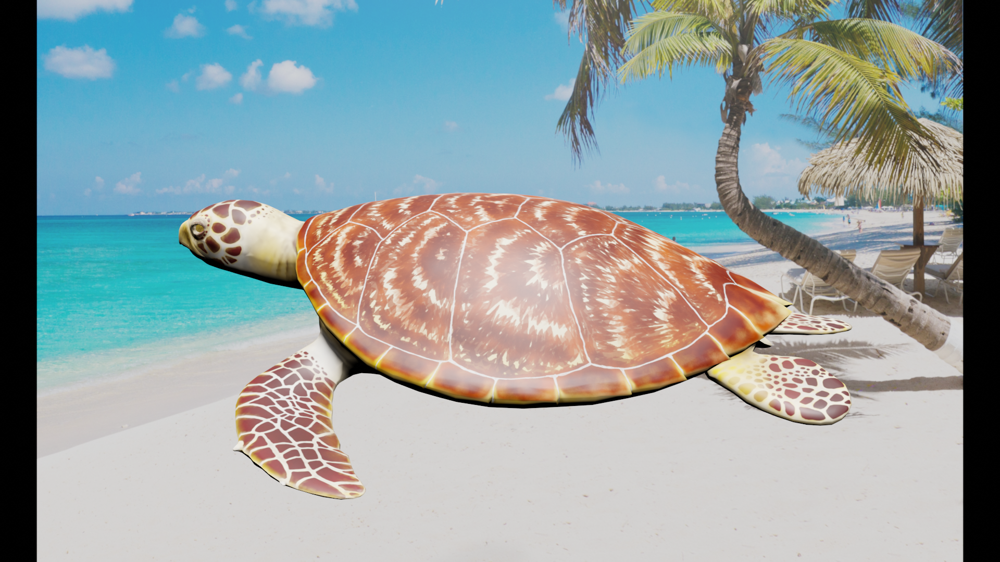

# SynthBlend


A library for generating simple synthetic images from withing Blender. Imposes a 3D model onto a predetermined background

## Requirements 
This library requires a Blender install of version >= 2.80. In order to work with models not already within the models directory, you must name your object the same as your file name. 

## Getting Started
There are no external dependencies to install for ```synthblend.py```, though if they exist in the future, they may be installed with 
```
pip install -r requirements.txt
```
To start running the script, you must change your current directory into the location of your Blender install. For example, 
```console
$ cd "C:\Program Files\Blender Foundation\Blender 2.83"
```
Next, run the script by specifying running a Python script in Blender in headless mode. For a basic working script (assuming that your synthblend directory is stored at ```C:\synthblend\```), run 
```console
$ .\blender -b --python C:\synthblend\synthblend.py -- -w C:\synthblend\synthblend.py
```
This will generate an image taken from a random angle, and output it to ```C:\synthblend\renders\```

## Usage
```console
.\blender -b --python <Location of synthblend.py> -- -w <Work Directory>
```
Generates a synthetic image with the supplied model, mesh, and background image 

## Options 
```-b --backgrounds``` Specify the backround images subdirectory  
```-bb --bounding_box {YOLO}``` Specify which bounding boxes to use (default is None)  
```-m --models``` Speficy the .dae object models and meshes subdirectory  
```-r --renders``` Specify the final renders subdirectory  
```-ra --radius``` Specify the spherical coordinate radius for the camera-background system  
```-rc --render_count``` Specify the current render count.  **NOTE** This will not create more renders, this is only useful as a naming convention when generating large amounts of synthetic data.  
```-pmin --phi_min``` Specify the minimum angle phi (angle from the vertical), in radians, to rotate the camera-background system. Must be between 0 and pi / 2, inclusive.  
```-pmax --phi_max``` Specify the maximum angle phi (angle from the vertical), in radians, to rotate the camera-background system. Must be between 0 and pi / 2, inclusive.  
```-tmin --theta_min``` Specify the minimun angle theta (angle about the horizontal), in radians, to rotate the camera-background system. Must be between 0 and 2 * pi, inclusive.  
```-tmax --theta_max``` Specify the maximum angle theta (angle about the horizontal), in radians, to rotate the camera-background system. Must be between 0 and 2 * pi, inclusive.  

## Model Directory Structure
Although there is some degree of lee-way in how you choose to organize your directories, the models directory is strict in terms of how files and subdirectories within it should be formatted. Within the models directory, models should be made available in the ```.dae``` file format. Additionally, each ```.dae``` object should have the same name as its accompanying file. Otherwise, blender will not be able to locate the object. To specify the meshes applicable to each object, create a directory within the models directory that shares the same name as the ```.dae``` file. In this directory that contains the meshes to be applied at random to the ```.dae``` model, the naming conventions for the image formats does not matter.